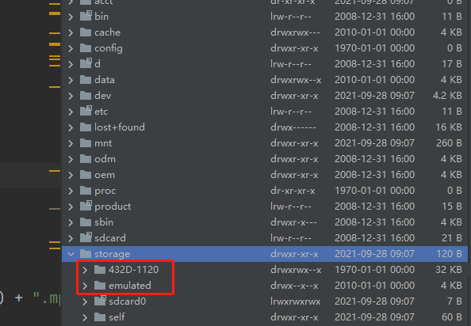
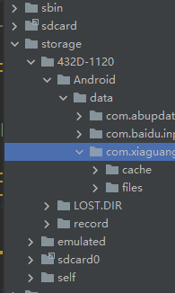

# SdCardFile
## Chinese [chinese-readme](https://github.com/jambestwick/SdCardFile/README.zh-CN.md)
android all sdk versions sdcard TF inner or removeable card read write.


The above picture shows the built-in card, 432D-1120 is an external TF card, and the simulation is the built-in sdcard file

After Android 9.0, it was found that the file manager failed to write when writing to the external SD card.
The File.canWrite() method found that it returned false. After discussing the tracking and positioning, it was found that Google caused
The result of a change: Google APP is no longer free to operate, but also a protection for the system.
But he created it externally by default
Cache and files under Android/data/com.xxx.xxx (xxx is the package name of your application) can be read and written.


Of course, the necessary permissions in AndroidManifest.xml are still required. Of course, the necessary permissions in AndroidManifest.xml are still required.

<uses-permission android:name="android.permission.READ_EXTERNAL_STORAGE"/>
<uses-permission android:name="android.permission.WRITE_EXTERNAL_STORAGE" />

There are also dynamic permissions after 6.0 to apply for by yourself

 ```java
    private void checkPermission() {
        if (Build.VERSION.SDK_INT >= 23) {
            if (ContextCompat.checkSelfPermission(this.mActivity, "android.permission.WRITE_EXTERNAL_STORAGE") != 0) {
                if (ActivityCompat.shouldShowRequestPermissionRationale(this.mActivity, "android.permission.WRITE_EXTERNAL_STORAGE")) {
                    this.mActivity.requestPermissions(new String[]{"android.permission.WRITE_EXTERNAL_STORAGE"}, 110);
                } else {
                    this.mActivity.requestPermissions(new String[]{"android.permission.WRITE_EXTERNAL_STORAGE"}, 110);
                }
                return;
            }
            if (this.isScreenshot) {
                this.saveToFile();
            } else {
                this.recordClick();
            }
        }

    }
```
