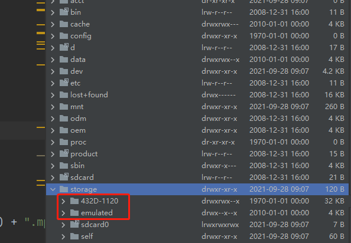
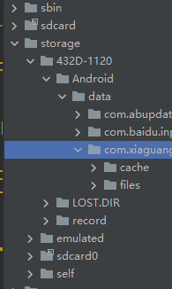

# SD卡文件的访问
安卓所有版本的内置外置的SDCAR的读写方案。  


上图说明内外置卡，432D-1120 是外置的TF卡，emulated是内置的sdcard文件

Android 9.0 后，发现文件管理器在写入外置 SD 卡时出现了写入失败的问题，定位到
File.canWrite() 方法，发现返回了 false。经过讨论追踪定位，发现是由于 Google
的一个更改导致的:google不允许APP再去随意操作外置，也是对系统的一种保护。
但是他默认在外置创建了
Android/data/com.xxx.xxx(xxx为你应用的包名)下cache、files 是可以进行读写的。


当然，在AndroidManifest.xml 必要的权限还是得有 当然，在AndroidManifest.xml 必要的权限还是得有

<uses-permission android:name="android.permission.READ_EXTERNAL_STORAGE"/>
<uses-permission android:name="android.permission.WRITE_EXTERNAL_STORAGE" />


还有6.0以后的动态权限自己去申请


 ```java
    private void checkPermission() {
        if (Build.VERSION.SDK_INT >= 23) {
            if (ContextCompat.checkSelfPermission(this.mActivity, "android.permission.WRITE_EXTERNAL_STORAGE") != 0) {
                if (ActivityCompat.shouldShowRequestPermissionRationale(this.mActivity, "android.permission.WRITE_EXTERNAL_STORAGE")) {
                    this.mActivity.requestPermissions(new String[]{"android.permission.WRITE_EXTERNAL_STORAGE"}, 110);
                } else {
                    this.mActivity.requestPermissions(new String[]{"android.permission.WRITE_EXTERNAL_STORAGE"}, 110);
                }
                return;
            }
            if (this.isScreenshot) {
                this.saveToFile();
            } else {
                this.recordClick();
            }
        } 

    }
```
